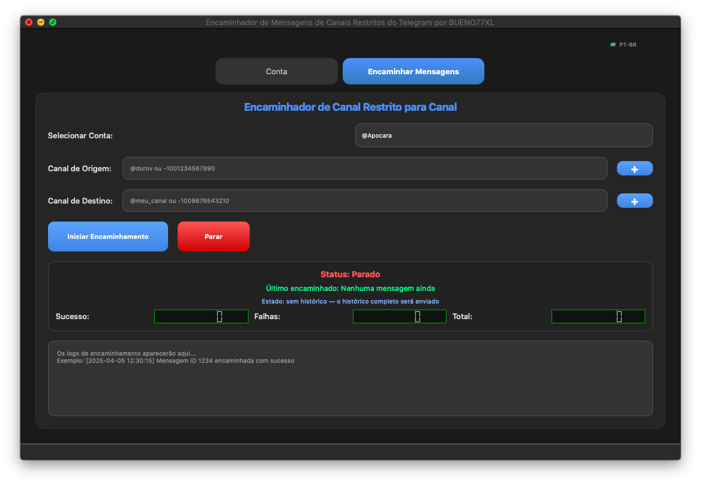

# Telegram BUENO77XL — Restricted Content Forwarder

<p align="center">
  
</p>

<p align="center">
  <a href="LICENSE"></a>
  =3.10" />
  
  
  
  
</p>

<p align="center">
  <strong>Solução desktop + daemon para encaminhamento de canais restritos do Telegram com estado incremental, GUI reativa e operação 24/7 em VPS.</strong>
</p>

<p align="center">
  <a href="#-instalação-rápida">Instalação</a> •
  <a href="#-como-usar">Como usar</a> •
  <a href="#-arquitetura">Arquitetura</a> •
  <a href="docs/DEPLOY_VPS.md">Deploy VPS</a> •
  <a href="#-testes">Testes</a>
</p>

---

## 📋 Índice

- [Visão Geral](#-visão-geral)
- [Principais Recursos](#-principais-recursos)
- [Arquitetura](#-arquitetura)
- [Estrutura do Projeto](#-estrutura-do-projeto)
- [Stack Tecnológica](#-stack-tecnológica)
- [Requisitos](#-requisitos)
- [Instalação Rápida](#-instalação-rápida)
- [Configuração](#-configuração)
- [Como Usar](#-como-usar)
- [Estado Persistente e Incremental](#-estado-persistente-e-incremental)
- [Deploy em VPS — Daemon Headless](#-deploy-em-vps--daemon-headless)
- [Testes](#-testes)
- [Segurança e Privacidade](#-segurança-e-privacidade)
- [Changelog Técnico](#-changelog-técnico)
- [Aviso Legal](#-aviso-legal)
- [Licença](#-licença)

---

## 🎯 Visão Geral

O **BUENO77XL Forwarder** resolve um problema real do Telegram: canais com conteúdo restrito bloqueiam o encaminhamento nativo. Este projeto automatiza o salvamento e reenvio via **API MTProto (Kurigram/Pyrogram)** mantendo fidelidade de mídia, legenda e agrupamento, com duas superfícies de execução compartilhando o mesmo estado:

- **GUI desktop (PyQt6 + qasync)** para uso interativo, com logs ao vivo, seletor de canais e feedback de progresso.
- **Daemon headless** para operação contínua em VPS, com reconexão, gravação atômica e integração `systemd`.

O diferencial é o **encaminhamento incremental**: após a primeira sincronização completa, apenas mensagens com `id > last_id` são enviadas, com persistência por tupla `(conta, origem, destino)` — cada destino mantém histórico independente.

---

## ✨ Principais Recursos

| Categoria | Detalhe |
|---|---|
| **Encaminhamento fiel** | Mensagens, mídias, álbuns, legendas e documentos preservados via `copy_message` / download controlado |
| **Incremental** | `data/state.json` com `last_id` por par origem→destino; gravação atômica após cada envio |
| **Multi-destino** | Mesma origem para N destinos com estados isolados |
| **GUI reativa** | `qasync` + `asyncio`, status colorido (verde/laranja/vermelho), progresso não-bloqueante, botão trava durante envio |
| **Seletor de canais** | Diálogo com busca que lista todos os chats da conta; preenche `@username` ou `id` automaticamente |
| **Multi-conta** | Gerenciamento de sessões `.session` em `account/`, combo exibindo `@username` |
| **Bilíngue** | `core/i18n.py` com PT-BR/EN em toda UI, diálogos, logs e mensagens de backend |
| **Daemon 24/7** | `tg-daemon` com `CHECK_INTERVAL` (default 120s), reconexão e `systemd` com `Restart=always` |
| **Seed sem reenvio** | `tg-seed` marca histórico já enviado (útil na migração da v1) |
| **Tema sênior** | `ui/theme/dark.py` — `Fusion` + `QPalette` escura apenas no `win32`; QSS explícito para `QTextBrowser`/`QListWidget`/`QComboBox` (corrige viewports brancos no `windowsvista`) |
| **Erros robustos** | `FloodWait`, `ChannelPrivate`, sessão expirada, timeout e falhas genéricas com mensagens acionáveis e limpeza de estado |

---

## 🏗️ Arquitetura

```
┌─────────────────┐         ┌──────────────────────┐         ┌──────────────┐
│  GUI (PyQt6)    │         │  Daemon (headless)   │         │ Telegram API │
│  main_window    │────┬───▶│  daemon.py           │────┬───▶│  (Kurigram)  │
│  + mixins       │    │    │  seed.py             │    │    └──────────────┘
└─────────────────┘    │    └──────────────────────┘    │
                       │              │                  │
                       ▼              ▼                  ▼
                 ┌──────────────────────────────────────────┐
                 │           core/forwarder.py              │
                 │  estado persistente · cópia ordenada     │
                 │  chave: account|from|to → last_id        │
                 └──────────────────────────────────────────┘
                              │            │
                              ▼            ▼
                       data/state.json  account/*.session
```

**Princípios:**
- `src` layout instalável (`pyproject.toml` + `hatchling`) — wrappers `main.py`/`daemon.py` na raiz são apenas shims de compatibilidade.
- `core/paths.py` resolve caminhos via detecção de `pyproject.toml` — funciona tanto em dev quanto instalado.
- `core/telegram.py` concentra cliente e helpers de resolução de chat; `core/forwarder.py` é puro e testável (sem dependência de UI).
- `ui/main_window/mixins/*` fatiam a `QMainWindow` monolítica original de 694 linhas em responsabilidades coesas (`client`, `forwarder`, `picker`, `account`, `language`, `ui_helpers`).

---

## 📁 Estrutura do Projeto

```
.
├── main.py / daemon.py / seed_state.py   # shims finos → src (compat)
├── src/telegram_forwarder/
│   ├── app.py                            # launcher GUI (14 linhas)
│   ├── __main__.py                       # python -m telegram_forwarder
│   ├── core/
│   │   ├── paths.py                      # resolução de caminhos
│   │   ├── telegram.py                   # TelegramClient + helpers
│   │   ├── forwarder.py                  # lógica incremental + estado
│   │   └── i18n.py                       # PT-BR/EN
│   ├── daemon/
│   │   ├── daemon.py                     # loop headless
│   │   └── seed.py                       # marca estado sem reenviar
│   └── ui/
│       ├── panel.py                      # painel de logs/inputs
│       ├── dialogs.py                    # CodeDialog / ChannelPicker
│       ├── theme/dark.py                 # Fusion + QPalette (win32 only)
│       └── main_window/
│           ├── window.py                 # QMainWindow + composição
│           └── mixins/{client,forwarder,picker,account,language,ui_helpers}.py
├── tests/
│   ├── test_state.py                     # persistência / normalização
│   └── test_pair.py                      # isolamento por par origem→destino
├── assets/{icon.jpg,screenshot.png}
├── config/{proxy.txt,.env.example}
├── docs/DEPLOY_VPS.md                    # guia e2-micro + systemd
├── data/.gitkeep / account/.gitkeep      # runtime (gitignored)
└── pyproject.toml                        # uv + hatchling + scripts
```

---

## 🧰 Stack Tecnológica

- **Runtime:** Python 3.10–3.12
- **Telegram:** `kurigram` (fork Pyrogram, import `pyrogram`) + `tgcrypto` opcional
- **GUI:** `PyQt6` (6.4.2 pinado no `darwin` para Catalina; ≥6.7 em win32/linux), `qasync`, `psutil`
- **Rede:** `aiohttp` (checagem de proxy)
- **Empacotamento:** `uv` + `hatchling` (`[project.scripts]` → `tg-forwarder`/`tg-daemon`/`tg-seed`)
- **Qualidade:** `ruff` (100 col, py310), `pytest` com `pythonpath = ["src"]`

---

## 📦 Requisitos

- Python 3.10+ e [uv](https://docs.astral.sh/uv/)
- Windows 10/11, Linux ou macOS
- Credenciais Telegram API (`API_ID` / `API_HASH` em https://my.telegram.org/apps)

---

## 🚀 Instalação Rápida

```bash
# 1. Clonar
git clone https://github.com/BU3NO77XL/telegram_bueno77xl.git
cd telegram_bueno77xl

# 2. Instalar dependências (cria .venv automaticamente)
uv sync

# 3. Rodar GUI — escolha um:
uv run tg-forwarder                    # recomendado (entry-point)
uv run python -m telegram_forwarder   # via módulo
uv run python main.py                 # via shim raiz
```

**Apenas daemon (VPS, sem GUI):**
```bash
uv sync --extra daemon
uv run tg-daemon
```

---

## ⚙️ Configuração

Copie e preencha o `.env` (nunca commite — já está no `.gitignore`):

```bash
cp .env.example .env        # ou cp config/.env.example .env
```

```ini
# Obrigatórias — https://my.telegram.org/apps
API_ID=2353733
API_HASH=9524edc39837e6aa1847990933dd7bf2

# Usadas pelo daemon/seed (conta deve existir em account/*.session)
PHONE=+5511999999999
FROM_CHAT=@canal_origem        # @username, t.me link ou -100xxxxxxxxxx
TO_CHAT=-1004461422809         # canal/grupo destino
CHECK_INTERVAL=120             # segundos entre verificações
```

> `account/*.session`, `data/*.json` e `.env` são runtime e estão gitignorados. `data/state.json` é criado automaticamente.

---

## 💻 Como Usar

### GUI

1. **Conta:** aba Conta → informe telefone + código → sessão salva em `account/`.
2. **Origem/Destino:** informe `@username`/`link`/`id` ou clique em `+` para abrir o seletor com busca.
3. **Idioma:** seletor discreto `PT-BR` / `EN` no canto superior direito.
4. **Iniciar:** clique em Iniciar — o rótulo `Estado:` mostra `sincronizado até id X` ou `sem histórico — histórico completo será enviado`. Logs e contador `Último encaminhado: id=X às HH:MM:SS` atualizam ao vivo.

### CLI / Atalhos

```bash
uv run tg-forwarder              # GUI
uv run tg-daemon                 # daemon headless
uv run tg-seed                   # marca histórico atual como enviado (sem reenviar)
uv run pytest                    # testes
```

---

## 🔁 Estado Persistente e Incremental

- Chave: `account|from_chat|to_chat` → `last_id` em `data/state.json` (escrita atômica).
- **Sem estado:** envia histórico completo.
- **Com estado:** envia apenas `id > last_id`, em ordem cronológica, atualizando após cada envio bem-sucedido — queda no meio retoma exato.
- GUI e daemon compartilham o mesmo arquivo; múltiplos destinos da mesma origem não se interferem.
- Migração da v1: `uv run tg-seed` lê o `id` mais recente da origem e grava o estado sem reenviar.

---

## ☁️ Deploy em VPS — Daemon Headless

Guia completo em **[docs/DEPLOY_VPS.md](docs/DEPLOY_VPS.md)** — resumo:

```bash
# Na VPS (Ubuntu/Debian)
curl -LsSf https://astral.sh/uv/install.sh | sh
cd ~/telegram_bueno77xl && uv sync --extra daemon
cp .env.example .env && nano .env
uv run tg-seed      # apenas 1x se já enviou histórico local
uv run tg-daemon    # teste manual
# systemd: /etc/systemd/system/tgforwarder.service → enable/start (ver docs)
journalctl -u tgforwarder -f
```

> Copie `account/`, `data/` e `.env` da máquina local para a VPS (`rsync -av --exclude '.git' ...`) para continuar de onde parou.

---

## 🧪 Testes

```bash
uv run pytest -v
# ou
uv run python -m pytest tests -v
```

- `tests/test_state.py` — estado vazio, persistência, normalização de chat, ids numéricos.
- `tests/test_pair.py` — isolamento de chave por par (mesma origem, destinos diferentes).

---

## 🔒 Segurança e Privacidade

- `.env`, `account/*.session`, `data/*.json`, `downloads/*`, `delete/*` estão no `.gitignore`.
- Nenhum dado pessoal versionado — exemplos usam `+5511999999999`/`@canal_origem`.
- Título da janela: **BUENO77XL**.
- Em VPS: `chmod 600 .env && chmod -R go-rwx account/ data/`.

---

## 📦 Changelog Técnico

<details>
<summary>Clique para expandir</summary>

- **Estrutura sênior:** `src` layout + `mixins` (fatia de `app.py` monolítico de 694 linhas).
- **Tema Windows:** `Fusion` + `QPalette` só em `win32`; QSS explícito para `QTextBrowser`/`QPlainTextEdit`/`QListWidget`/`QComboBox QAbstractItemView`/`QScrollBar`.
- **Incremental:** `core/forwarder.py` com estado atômico por tupla.
- **Daemon:** `daemon.py` + `seed.py` + extra `daemon` no `pyproject.toml`.
- **GUI:** cores de status, seletor com busca, combo `@username`, rótulo de estado, botão travado durante envio, tratamento `FloodWait`/sessão expirada.
- **i18n:** `core/i18n.py` com `t()` e `backend_message()` em toda superfície.
- **Testes:** `test_state.py` + `test_pair.py`.

</details>

---

## ⚠️ Aviso Legal

Projeto para **fins educacionais, de pesquisa e administrativos**. Não fornece nem incentiva burla a configurações de privacidade do Telegram ou acesso a dados ocultos. Qualquer uso que viole os **Termos de Serviço do Telegram** ou leis locais é estritamente proibido. Use apenas dados com **consentimento explícito** ou conjuntos anonimizados/de teste.

---

## 📄 Licença

[MIT](LICENSE) — Copyright (c) 2026 BU3NO77XL.

---

<p align="center">
  Feito com Python, PyQt6 e Kurigram — por <strong>BUENO77XL</strong>.
</p>
